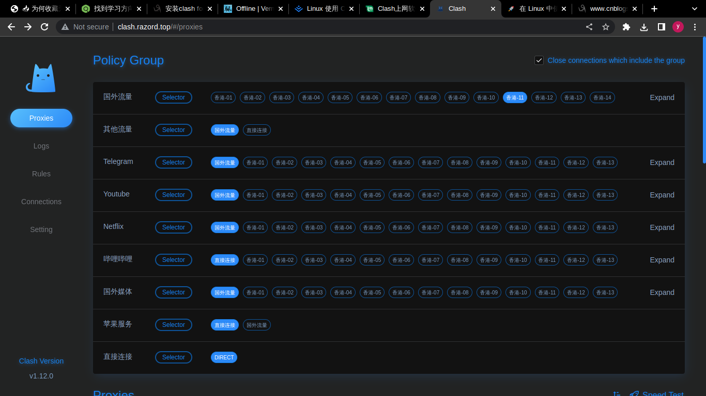

- ---
- #### The #abbreviation for #kilo is #k. #idea
- ***Notes***
	- #Kilo is one thousand
- ***References***
	- 
	- 
	- [K - Wikipedia](https://en.wikipedia.org/wiki/K#:~:text=In%20the%20International%20System%20of,km%20signifies%20a%20thousand%20metres.)
- ---
- #### Usage of the #Clash #application in #Linux
	- `chmod u+x clash-linux-amd64-v1.12.0` # Run this command after [downloading](https://github.com/Dreamacro/clash/releases) and decompressing
	- `mv clash-linux-amd64-v1.12.0 clash`
	- `sudo mv clash /usr/local/bin/`
	- `clash` # Initialization
- ***Notes***
	- Configure #Clash
		- `mv yourClashConfig.yaml config.yaml` # Rename it to *config.yaml* after downloading *yourClashConfig.yaml*
		- `cp config.yaml ~/.config/clash/config.yaml`
	- Set environment
		- `sudo vim /etc/environment`
		  ```
		  # Proxy
		  export http_proxy="127.0.0.1:7890"
		  export https_proxy="127.0.0.1:7890"
		  export no_proxy="localhost, 127.0.0.1"
		  ```
	- Enable #Clash
		- `clash` # Type it in your terminal (e.g. #Alacritty )
	- Optional: Set temporarily
		- `http://clash.razord.top/` # Type it in your web browser search bar
- ***References***
	- 
	- 
	- [Clash上网软件 | Linux Mint学习笔记](https://skyao.io/learning-linux-mint/docs/daily/network/clash.html)
- ---
- #### The #abbreviation for the [[solid-state drive]] is #SSD. #idea
	- A storage device
- ***References***
	- 
	- [Solid-state drive - Wikipedia](https://en.wikipedia.org/wiki/Solid-state_drive)