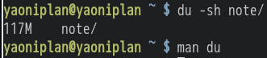
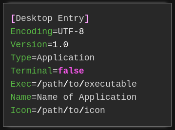

- ---
- #### Understand an #idiom about #惨不忍睹. #idea
- ***Notes***
	- `睹` # Look with eyes
- ***References***
	- 
	- [慘不忍睹的意思 - 成語字典](https://www.chinesewords.org/idiom/show-3093.html)
- ---
- #### Check the file size of a directory in #Linux
	- `du -sh note/`
- ***Notes***
	- `du` # Device usage
	- `-s` # --summarize
	- `-h` # --human-readable
	- `note/` # a directory
- ***References***
	- 
	- 
	- `man du`
- ---
- #### Create a .desktop file for #application in #Linux
	- `sudo vim /usr/share/applications/logseq.desktop`
	  ```
	  [Desktop Entry]
	  Encoding=UTF-8
	  Version=1.0
	  Type=Application
	  Terminal=false
	  Exec=/usr/bin/Logseq
	  Name=Logseq
	  Icon=logseq
	  ```
- ***Notes***
	- `Exec=/usr/bin/Logseq` # Replace */usr/bin/Logseq* with a executable path of application
	- `Name=Logseq` # Replace *logseq* with a name of application
- ***References***
	- 
	- [How to Create a .Desktop File for Your Application in Linux - Make Tech Easier](https://www.maketecheasier.com/create-desktop-file-linux/)