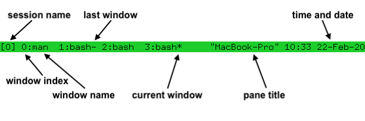

- #### Use #tmux
	- `tmux ls`
	- `C-b ?`
	- `C-b :`
		- `kill-server`
		- `neww` # new-window
		- `splitw` # split-window
		- `attach -t 1` # attach session 1
		- `rename 1` # rename-session (active)
		- `renamew 1` # rename-window (active)
		- `choose-tree` # (As same as `C-b w`)
			- `q` # exit tree mode
	- `C-b c`
	- `C-b w` # tree mode
	- `C-b x` # kill the active pane (different form `exit`)
	- `C-b [` # Refer this [link](https://man.openbsd.org/tmux#WINDOWS_AND_PANES)
		- `Space` # Select what you want to copy
		- `Enter` # copy after select what you want to copy
	- `C-b ]` # paste
	- `C-b =` # Buffer mode
- ***Notes***
	- `tmux ls` # List all sessions
		- `ls` # list-sessions
	- `C-b ?` # List key bindings
		- `C-b` # A prefix key (Means pressing the `Ctrl` key and `b` together)
		- `?` # Press the `?` key after that
	- `C-b :`
		- `C-b :` # Display a command prompt
		- `kill-server` # Kill tmux entirely (Including sessions, windows and panes)
	- `C-b c` # Create a new window
		- `c` # Create
- ***References***
	- 
	- `man tmux`
	- [Getting Started · tmux/tmux Wiki](https://github.com/tmux/tmux/wiki/Getting-Started)
	- [Everything you need to know about Tmux copy paste - Ubuntu · rushiagr](https://www.rushiagr.com/blog/2016/06/16/everything-you-need-to-know-about-tmux-copy-pasting-ubuntu/)
- ---
- #### Replace #sudo with #doas in [[Gentoo Linux]]
	- `sudo emerge -aq app-admin/doas`
	- `sudo vim /etc/doas.conf`
	- `sudo vim ~/.bashrc`
- ***Notes***
	- `sudo vim /etc/doas.conf` 
	  ```
	  # Allow all users in the wheel group to execute any command as root
	  permit :wheel
	  
	  # Allow a user to use a command (e.g. reboot, poweroff, etc.) without a password
	  permit nopass yaoniplan cmd reboot
	  permit nopass yaoniplan cmd poweroff
	  ```
	- `sudo vim ~/.bashrc` # Configure completion for doas
	  ```
	  complete -cf doas
	  ```
- ***References***
	- [doas - Gentoo Wiki](https://wiki.gentoo.org/wiki/Doas)