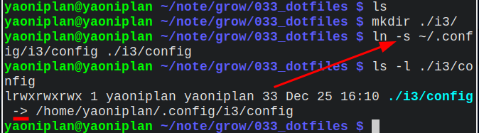

- ---
- The #abbreviation of [[HyperText Markup Language]] is #HTML.
- ***Notes***
	- A markup language
	- A file format
- ***References***
	- 
	- [HTML - Wikipedia](https://en.wikipedia.org/wiki/HTML)
- ---
- The #punctuation of #tilde is `~`.
- ***References***
	- 
	- [Tilde - Wikipedia](https://en.wikipedia.org/wiki/Tilde)
- ---
- #### Remove a symbolic link in #Linux
	- `unlink ./i3/config`
- ***References***
	- 
	- 
	- `man unlink`
- ---
- #### Create a symbolic link in #Linux
	- `ln -s ~/.config/i3/config ./i3/config`
- ***Notes***
	- `ln` # Link
	- `-s` # Symbolic
	- `~/.config/i3/config` # A hard link
	- `./i3/config` # A symbolic link
		- `mkdir ./i3/` # Make a directory before using the *ln* command
	- Optional: Check the symbolic link and the hard link
		- `ls -l ./i3/config`
- ***References***
	- 
	- `man ln`
	- [Dotfiles – What is a Dotfile and How to Create it in Mac and Linux](https://www.freecodecamp.org/news/dotfiles-what-is-a-dot-file-and-how-to-create-it-in-mac-and-linux/)
- ---
- #### Copy text from #tmux to clipboard in #Linux
	- `doas vim /etc/tmux.conf`
	  ```
	  bind -T copy-mode-vi Enter send-keys -X copy-pipe-and-cancel "xclip -i -f -selection primary | xclip -i -selection clipboard"
	  ```
- ***Notes***
	- `"xclip -i -f -selection primary | xclip -i -selection clipboard"`
		- `-i` # -in
		- `-f` # -filter
		- `doas emerge -aq x11-misc/xclip` # Install it to use the *xclip* command
- ***References***
	- 
	- `man xclip`
	- [tmux in practice: integration with system clipboard](https://www.freecodecamp.org/news/tmux-in-practice-integration-with-system-clipboard-bcd72c62ff7b/)