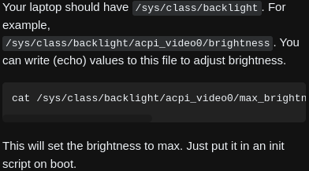

- ---
- #### Execute a script at boot time in [[Gentoo Linux]] with #OpenRC
	- `doas vim /etc/local.d/script.start`
	- `doas chmod a+x /etc/local.d/script.start`
- ***Notes***
	- `doas vim /etc/local.d/script.start`
	  ```
	  #! /bin/sh
	  
	  # Set the brightness to 30% (1465/4882)
	  echo 1465 > /sys/class/backlight/intel_backlight/brightness
	  ```
		- A script about brightness
- ***References***
	- 
	- [/etc/local.d - Gentoo Wiki](https://wiki.gentoo.org/wiki//etc/local.d)
	- [linux mint - How do I set default brightness after boot? - Unix & Linux Stack Exchange](https://unix.stackexchange.com/questions/30924/how-do-i-set-default-brightness-after-boot)