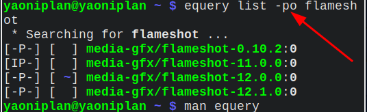

- ---
- #### Downgrade for software in [[Gentoo Linux]]
	- `doas emerge =media-gfx/flameshot-11.0.0`
- ***Notes***
	- `=media-gfx/flameshot-11.0.0`
		- `equery list -po flameshot` # Check what package versions are available
			- `-p` # Portage-tree
			- `-o` # Overlay-tree
- ***References***
	- 
	- 
	- `man equery`
	- [linux - How to select the software's version in gentoo by emerge? - Stack Overflow](https://stackoverflow.com/questions/13705901/how-to-select-the-softwares-version-in-gentoo-by-emerge)
- ---
- #### Set a proxy for the phone when the phone does not have proxy software
	- HTTP (e.g. *web browser*)
		- Proxy settings: Manual
		- Proxy hostname: 192.168.10.107
		- Proxy port: 7890
	- Socks5 (e.g. *Telegram*)
		- Server: 192.168.10.107
		- Port: 7891
- ***Notes***
	- `192.168.10.107`
		- `ip address` # Get computer IP address
		  ```
		  inet 192.168.10.107/24 brd 192.168.10.255 scope global dynamic noprefixroute eno1
		  ```
	- Advantages
		- Faster than using mobile proxy software
	- Disadvantages
		- Keep computer on
- ***References***
	- 
	- 
	- 