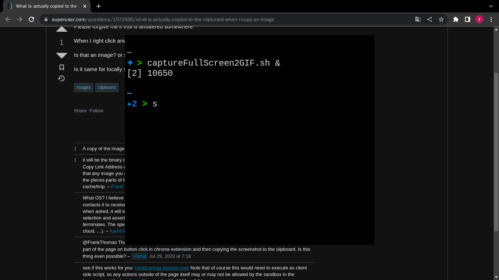

- #### Semicolon do at shell script
    - Put two or more commands on the same line
    - Execute commands in order
- ***Notes***
    - `sleep 3s; notifi-send "test"`
        - Execute the *sleep* command first and then execute the *notify-send* command
- ***References***
    - 
    - https://stackoverflow.com/questions/25669540/what-is-the-difference-between-double-ampersand-and-semicolon-in-linux
    - https://unix.stackexchange.com/questions/159513/what-are-the-shells-control-and-redirection-operators/159514#159514
    - https://www.javatpoint.com/linux-semicolon
- ---
- #### Split a specified buffer in Vim
    - `:vs #5`
- ***Notes***
    - `vs` # Vertically split
    - `:buffers` # Show all buffers
- ***References***
    - `:help :buffers`
    - `:help :vs`
    - 
    - https://vi.stackexchange.com/questions/8122/how-to-open-a-file-from-active-buffer-into-a-split-window
    - https://superuser.com/questions/134176/how-to-split-existing-buffer-vertically-in-vim#:~:text=To%20put%20an%20existing%20buffer,of%20the%20next%20split%20command.
    - https://vi.stackexchange.com/questions/76/can-i-open-a-new-vim-split-from-an-existing-buffer/21081#21081
- ---
- #### Execute two commands at the same time
    - `paplay /usr/share/sound/alsa/Noise.wav & notify-send "test" &`
- ***Notes***
    - `&` # Execute in the background
- ***References***
    - 
    - https://www.quora.com/How-do-you-run-two-commands-simultaneously-in-a-terminal
- ---
- #### View processes in the background
    - `jobs` # Display status of jobs
- ***Notes***
    - `kill %3` # Kill process 3
- ***References***
    - 
    - `help jobs`
    - https://www.cyberciti.biz/faq/find-out-what-processes-are-running-in-the-background-on-linux/
- ---
- #### Solve the swap file in Vim
    - `R` # Recovery
    - `:w` # Write
    - `:e` # Edit
    - `D` # Delete
- ***References***
    - Add a demo.gif here
    - https://superuser.com/questions/480367/whats-the-easiest-way-to-delete-vim-swapfiles-ive-already-recovered-from/1563076#1563076
- ---
