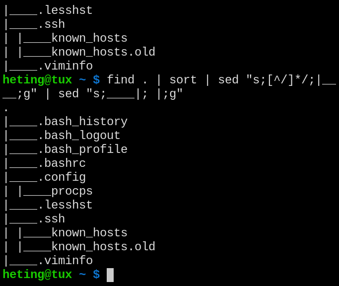
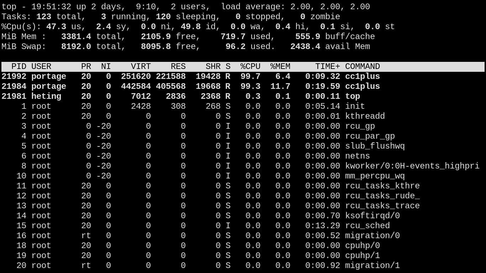

- #### Use "tree"
    - `tree -L 2 .`
- ***Notes***
    - `tree -L 1 {01..10}`
    - `-L` # Level
    - `.` # Your directory
- ***References***
    - `man tree`
- ---
- #### Replace the tree command with built-in commands
    - `find . | sort | sed "s;[^/]*/;|____;g" | sed "s;____|; |;g"`
- ***Notes***
    - `.` # Under the current directory
    - `;` # The delimiter (e.g. /)
- ***References***
    - Output
      ```
      .
      |____.bash_history
      |____.bash_logout
      |____.bash_profile
      |____.bashrc
      |____.config
      | |____procps
      |____.lesshst
      |____.ssh
      | |____known_hosts
      | |____known_hosts.old
      |____.viminfo
      ```
    - 
    - https://stackoverflow.com/questions/23952984/tree-functionality-using-sed-and-find-command/23953129#23953129
- ---
- #### Back up the full system
    - `vim /root/full-backup/full-backup.sh`
      ```
      BEFORE=$(df -h)
      STARTED=$(date)
      DATE=`date "+%Y-%m-%d"`
      
      DEST="/mnt/backup/$DATE"
      
      rsync --archive --acls --xattrs --delete --progress --verbose --exclude-from=exclude.txt --link-dest=/mnt/backup/last --mkpath / $DEST
      
      ln --symbolic --force --no-dereference $DATE /mnt/backup/last
      
      echo "Started at:   " $STARTED
      echo "Current time: " $(date)
      
      echo "Before:
      
      $BEFORE
      
      Now:
      "
      
      df -h
      ```
    - `vim /root/full-backup/exclude.txt`
      ```
      /dev/*
      /proc/*
      /sys/*
      /run/*
      /var/db/repos/gentoo
      /var/db/repos/guru
      /tmp/*
      /var/tmp
      /lost+found
      /mnt/*
      /home/heting/.npm
      /home/heting/.cache
      /home/heting/go/pkg/mod/cache
      ```
- ***Notes***
    - `heting` # Replace it with your user name
    - Restore
        - `rsync --archive --acls --xattrs --progress --verbose . /mnt`
- ***References***
    - 
    - https://wiki.gentoo.org/wiki/Rsync#Backuping
- ---
- #### Generate random string in Linux
    - `openssl rand -base64 22`
- ***Notes***
    - `rand` # Random
- ***References***
    - `man openssl`
    - https://linuxhint.com/generate-random-string-bash/
- ---
- #### Use "top"
    - `k` # Kill
    - `L` # Locate
    - `m` # Memory
    - `t` # Task
    - `1` # CPU
    - `c` # Full path
    - `h` # Help
    - `q` # Quit
- ***Notes***
    - `top -n 1` # The same as `top` then press `q`
        - `-n` # Number
- ***References***
    - 
    - https://askubuntu.com/questions/484510/how-to-run-top-command-1-time-and-exit/484515#484515
    - https://devhints.io/top
- ---
- #### Use "htop" 
    - `/logseq` # Search a process
    - `k` # Kill a process
    - `Enter` # Comfirm deletion
- ***Notes***
    - Because to delete some software that takes up a lot of processes.
- ---
- #### Redirect standard error stream to null
    - `find / -type f -user bandit7 -group bandit6 -size 33c 2>/dev/null`
- ***Notes***
    - `-user` # Own by user
        - `bandit7` # A user
    - `-group` # Belong to group
        - `bandit6` # A group
    - `2>` # Redirect stderr
    - `/dev/null` # Null
    - `vim ~/.local/bin/getIPInformation.sh`
      ```
      # Output the result using notify-send if available, echo otherwise
      if ! notify-send "$outputResult" 2>/dev/null; then
          echo "$outputResult"
      fi
      ```
- ***References***
    - ChatGPT
    - `man find`
    - 
    - https://askubuntu.com/questions/350208/what-does-2-dev-null-mean/350216#350216
    - https://medium.com/@theGirlWhoEncrypts/overthewire-bandit-level-6-level-7-e1930ac68a54
    - https://overthewire.org/wargames/bandit/bandit7.html
- ---
