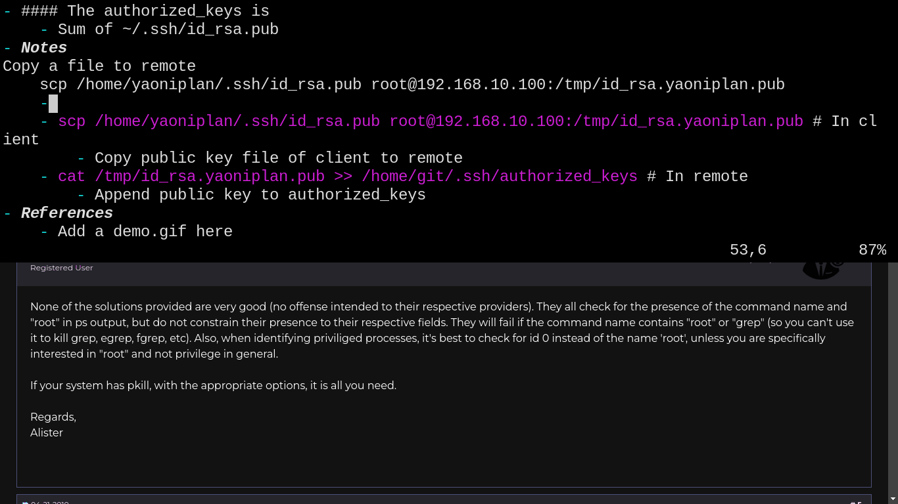

- #### Use "kitty"
    - `vim ~/.config/kitty/kitty.conf`
      ```
      # Disable audio bell
      enable_audio_bell no
      
      # Set font size
      font_size 18.0
      ```
- ***Notes***
    - Because for quiet and readability.
- ***References***
    - https://www.reddit.com/r/KittyTerminal/comments/m3dnrq/comment/gqpeiii/?utm_source=share&utm_medium=web2x&context=3
    - https://sw.kovidgoyal.net/kitty/conf/#terminal-bell
- ---
- #### Switch between windows with dmenu
    - Install manually
      ```
      git clone https://github.com/NikitaIvanovV/dmenu-win
      cd ./dmenu-win/
      doas make install
      ```
- ***Notes***
    - `doas make uninstall` # Uninstall manually
    - Another way
        - Download https://tools.suckless.org/dmenu/scripts/switch
        - Put it into your PATH (e.g. ~/.local/bin/)
        - `chmod u+x ~/.local/bin/switch` # Modify user executable permissions for the script
        - Type the `switch` in your search bar of dmenu
- ***References***
    - 
    - https://github.com/NikitaIvanovV/dmenu-win
- ---
- #### Try to use drop down terminal in i3
    - `xfce4-terminal --drop-down` # It works but quits when not focused
    - tdrop # Not used yet because of too many dependencies
    - qterminal # It works but quits when not focused
    - tilda # It will create a new workspace
    - guake # It works well
    - yakuake # It works well on KDE
- ---
- #### Delete 2 lines in the upward direction in Vim
    - `V2kd`
- ***Notes***
    - `V` # Visual line mode
    - `k` # Up
    - `d` # Delete
    - The above method will delete the current line
- ***References***
    - 
    - https://stackoverflow.com/questions/6954755/delete-n-lines-in-the-up-direction-in-vim
- ---
