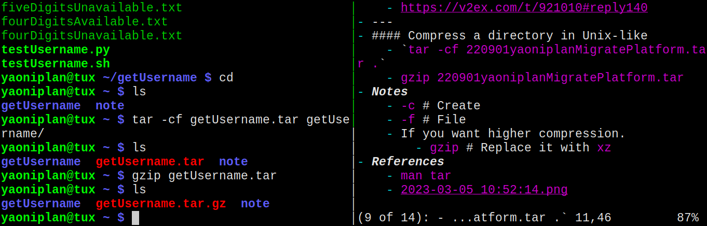

- #### Trying to build a blog
    - No comment system
    - Markdowm # Simple
    - Searchable
    - Waterfalls flow
- ***References***
    - https://blog.est.im/
    - https://v2ex.com/t/921010#reply140
- ---
- #### Compress a directory in Unix-like
    - `tar -cf getUsername.tar getUsername/`
    - `gzip getUsername.tar`
- ***Notes***
    - `-c` # Create
    - `-f` # File
    - `getUsername/` # Replace it with your desired compressed directory
    - If you want higher compression.
        - `gzip` # Replace it with `xz`
- ***References***
    - `man tar`
    - 
- ---
