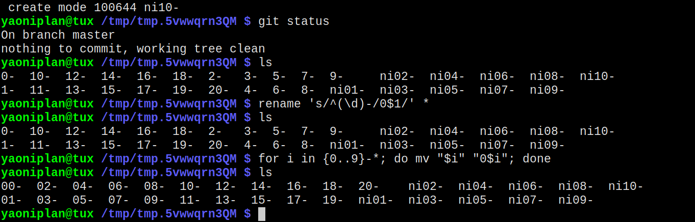

- #### The abbreviation of "artificial intelligence" is "AI".
    - An intelligence
- ***References***
    - https://en.wikipedia.org/wiki/Artificial_intelligence
- ---
- #### Add string "230317" to the beginning of each file name in one-liner Bash
    - `for f in *; do mv "$f" "230317$f"; done`
- ***Notes***
    - `f` # A variable
    - `for f in *; do mv "$f" "${f:6}"; done` # Remove the first 6 letters
- ***References***
    - ChatGPT
    - 
    - 
- ---
