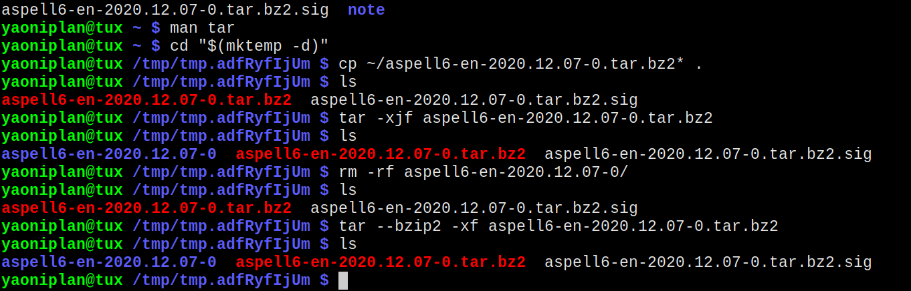

- #### Call a Bash function in another file
    - `vim ~/.local/bin/master.sh`
      ```
      notification() {
          notify-send "$notificationMessage" &

          for i in {1..2}; do
              paplay "$audioFile"
          done
      }
      ```
    - `vim ~/.local/bin/remindMe.sh`
      ```
      notificationMessage="Time is up!"
      audioFile="/home/yaoniplan/note/assets/doorbell.mp3"
      
      source $HOME/.local/bin/master.sh
      
      sleep "$1"; notification
      ```
- ***Notes***
    - `source $HOME/.local/bin/master.sh` # Source the file
        - `chmod u+x ~/.local/bin/master.sh`
        - Use full path to avoid errors when souce a file
    - Because to improve the code reusability.
- ***References***
    - ChatGPT
- ---
- #### Decompress a ".tar.bz2" file in Linux
    - `tar --bzip2 -xf aspell6-en-2020.12.07-0.tar.bz2`
- ***References***
    - `man tar`
    - ChatGPT
    - 
- ---
- #### Act as an IT expert in ChatGPT
  ```
  I want you to act as an IT Expert. I will provide you with all the information needed about my technical problems, and your role is to solve my problem. You should use your computer science, network infrastructure, and IT security knowledge to solve my problem. Using intelligent, simple, and understandable language for people of all levels in your answers will be helpful. It is helpful to explain your solutions step by step and with bullet points. Try to avoid too many technical details, but use them when necessary. I want you to reply with the solution, not write any explanations. My first problem is 
  ```
- ***Notes***
    - My next problem is "Explain the meaning of 'IT'"
    - Because to get accurate results whthin a range.
- ***References***
    - https://github.com/f/awesome-chatgpt-prompts#act-as-an-it-expert
- ---
- #### The abbreviation of "information technology" is "IT".
    - A branch of computer science
- ***References***
    - https://en.wikipedia.org/wiki/Information_technology
- ---
