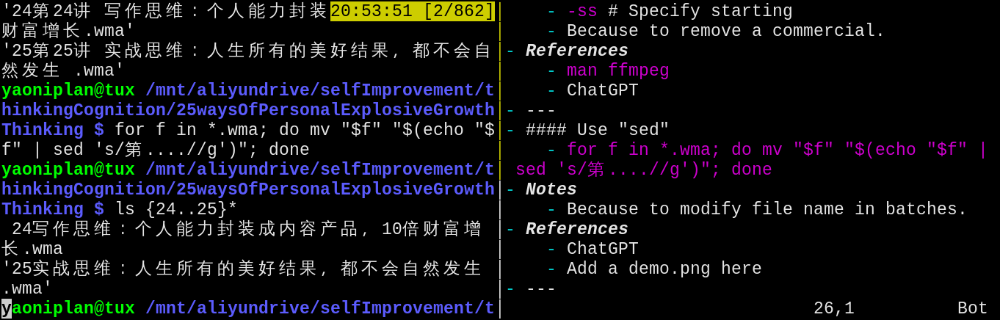

- #### Show the next 10 lines after the line
    - `grep -A 10 "Artificial" note/pages/Future.md`
- ***Notes***
    - `-A` # After
- ***References***
    - ChatGPT
    - `man grep`
    - 
- ---
- #### Use "ffmpeg"
    - `ffmpeg -i 231012seeADentist.m4a 231012seeADentist.mp3` # Convert M4A to MP3 format
        - `for f in *.mp4; do ffmpeg -i "$f" "${f%.mp4}.mp3"& done` # In batches
        - `%` # Remove extension (e.g. `.mp4`)
        - `&` # In the background
    - `ffmpeg -f v4l2 -i /dev/video0 output.mp4` # Capture video from camera
    - `ffmpeg -i input.wma -ss 00:00:25 -c copy output.wma` # From 00:00:25 to the end
    - `ffmpeg -i input.wma -ss 00:00:00 -to 00:15:37 -c copy output.wma` # Cut a section
    - `ffmpeg -f concat -safe 0 -i fileList.txt -c copy output.wma` # Merge videos
        - `vi fileList.txt`
          ```
          file 'output01.wma'
          file 'output02.wma'
          ```
- ***Notes***
    - `-i` # Input
    - `-ss` # Specify starting
    - `-f` # Format
    - `concat` # Concatenate
    - Because to remove a commercial.
- ***References***
    - `man ffmpeg`
    - ChatGPT
- ---
- #### Use "sed"
    - `sed -i 's/dotfilels/dotfiles/g' ~/.bashrc`
    - `for f in *.wma; do mv "$f" "$(echo "$f" | sed 's/第....//g')"; done`
- ***Notes***
    - `for f in *; do mv "$f" "$(echo "$f" | sed -E 's/([1][3-9]|[2][0-4])/echo $((\1-12))/ge')"; done` # Subtract 12 from the numbers 13 to 24
        - `([1][3-9]|[2][0-4])` # Match numbers 13 to 24
        - `e` # Arithmetic expression (e.g. `$((\1-12))`)
    - `for f in *; do mv "$f" "$(echo "$f" | sed 's/ //g')"; done` # Remove all spaces in file names
    - `.` # Any single character
    - Because to modify file name in batches.
- ***References***
    - 
    - 
    - ChatGPT
- ---
