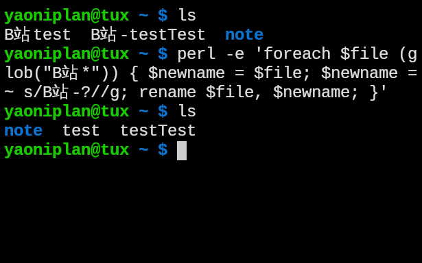

- #### Rename file in Perl
    - `perl -e 'foreach $file (glob("B站*")) { $newname = $file; $newname =~ s/B站-?//g; rename $file, $newname; }'`
- ***Notes***
    - `-e` # Execute
    - `glob` # Global
    - `?` # Zero or one
    - Another way
        - `for f in B站*; do mv "$f" $(echo "$f" | sed -E 's/B站-?//g'); done`
        - `-E` # Extended
- ***References***
    - ChatGPT
    - `man sed`
    - `perldoc -f rename`
        - `-f` # Function
    - 
- ---
