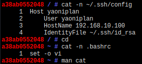

- #### Search for content in C language on GitHub
    - `language:C todo`
- ***Notes***
    - `C` # Replace it with other language (e.g. Bash, Python etc.)
    - `created:2020-01-01..2021-01-01` # Created date
- ***References***
    - ChatGPT
- ---
- #### Install Gentoo Linux in Docker on Arch Linux
    - `doas docker pull gentoo/stage3:latest` # Download about 400 Mb
    - `doas docker run -it gentoo/stage3:latest /bin/bash` # Run
- ***Notes***
    - `doas pacman -S docker` # Install in Arch Linux
    - `doas systemctl start docker` # Once now
    - Restart and interact with the last exited Docker container
        - `doas docker start a38ab0552048`
        - `doas docker exec -it a38ab0552048 /bin/bash`
    - Because someone in the group shared the news of success.
- ***References***
    - 
    - `docker exec --help`
        - `-i` # Interactive
        - `-t` # Tty
    - `docker ps --help`
        - `docker ps --all` # Get CONTAINER ID (e.g. a38ab0552048)
    - ChatGPT
- ---
- #### Delete the fifth through seventh lines from a file with sed
    - `sed -i '5,7d' ~/.ssh/config`
- ***Notes***
    - `-i` # In place
    - `d` # Delete
- ***References***
    - 
    - `man sed` # `/delete`
    - ChatGPT
- ---
- #### Number all output lines in Linux
    - `cat -n ~/.ssh/config`
- ***Notes***
    - `-n` # Number
    - Because suitable for files with fewer lines in teaching.
- ***References***
    - 
    - `man cat` # `/number`
- ---
