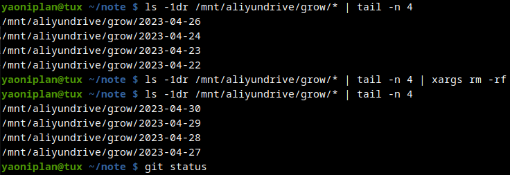

- #### Delete redundant directories in Linux
    - `ls -1dr "$destinationDir"/* | tail -"$quantityToDelete" | xargs rm -rf`
- ***Notes***
    - `-1` # One per line
    - `-d` # Directory
    - `-r` # Reverse
    - `xargs` # Execute arguments
    - Because to backup files with a scirpt automatically.
- ***References***
    - `man ls`
    - `man xargs`
    - 
    - ChatGPT
- ---
