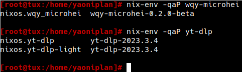

- #### The abbreviation of "QEMU Copy On Write 2" is "qcow2".
    - A format
- ***Notes***
    - Because to use qemu command.
- ***References***
    - ChatGPT
- ---
- #### Use "parted"
    - `parted /dev/sda -- rm 3` # Remove the third partition (/dev/sda3)
- ***Notes***
    - Because typed the wrong command accidentally when partitioning.
- ***References***
    - `lsblk`
    - ChatGPT
- ---
- #### Search for package names in NixOS
    - `nix-env -qaP wqy-microhei`
- ***Notes***
    - `-q` # Query
    - `-a` # Available
    - `-P` # Path
    - Another way
        - https://search.nixos.org/
    - `vim /etc/nixos/configuration.nix`
      ```
      users.users.yaoniplan = {
        packages = with pkgs; [
          wqy_microhei
        ];
      };
      ```
        - Because to solve the problem of garbled Chinese fonts.
- ***References***
    - 
    - `man nix-env`
    - ChatGPT
- ---
- #### Install KDE Plasma in NixOS
    - `vim /etc/nixos/configuration.nix`
      ```
      services.xserver.enable true;
      services.xserver.displayManager.sddm.enable = true;
      services.xserver.desktopManager.plasma5.enable = true;
      ```
- ***Notes***
    - `nixos-rebuild switch --option substituters https://mirrors.ustc.edu.cn/nix-channels/store` # Rebuild to make changes effective
    - Use Wayland (Warning: It has some bugs)
        - Select "Plasma (Wayland)" of Desktop Session in SDDM
    - Because to master it quickly.
- ***References***
    - https://www.reddit.com/r/NixOS/comments/10c72dy/how_do_i_setup_nixos_plasma_wayland_in/
    - https://nixos.wiki/wiki/KDE
- ---
- #### Use ssh in NixOS
    - `vim /etc/nixos/configuration.nix`
      ```
      # Enable the OpenSSH daemon in NixOS
      services.openssh.enable = true;
      ```
- ***Notes***
    - Because to use the command `ssh yaoniplan@192.168.10.105 -p 60022` in another computer.
- ---
- #### Install packages for root user in NixOS
    - `vim /etc/nixos/configuration.nix`
      ```
      # List packages installed in system profile. To search, run:
      # $ nix search wget
      environment.systemPackages = with pkgs; [
        vim
        git
        wget
      ];
      ```
- ***Notes***
    - Because to use vim to edit configuration.nix file.
- ---
- #### Add a user to multiple groups in NixOS
    - `vim /etc/nixos/configuration.nix`
      ```
      # Define a user account. Don't forget to set a passwd with `passwd`.
      users.users.yaoniplan = {
        isNormalUser = true;
        extraGroups = [ "wheel" "networkmanager" ]; # Enable `sudo` for the user.
        packages = with pkgs; [
          git
          vim
          wget
        ];
      };
      ```
- ***Notes***
    - Because to use the sudo command `sudo chown -R yaoniplan:yaoniplan /mnt/yaoniplan/`.
        - `groupadd yaoniplan` # Add a group in Linux to solve the problem
          ```
          [root@tux:~]# chown -R yaoniplan:yaoniplan /mnt/yaoniplan/
          chown: invalid group: ‘yaoniplan:yaoniplan’
          
          [root@tux:~]#
          ```
- ***References***
    - https://nixos.org/manual/nixos/stable/index.html#sec-user-management
- ---
- #### Enable sound or volume in NixOS
    - `vim /etc/nixos/configuration.nix`
      ```
      # Enable sound.
      sound.enable = true;
      hardware.pulseaudio.enable = true;
      ```
- ---
- #### Set time zone in NixOS
    - `vim /etc/nixos/configuration.nix`
      ```
      time.timeZone = "Asia/Shanghai";`
      ```
- ***Notes***
    - `timedatectl` # View the current time zone
    - `Asia/Shanghai` # Replace it with your desired time zone
        - `timedatectl list-timezones` # List all time zones
- ---
- #### Set locale in NixOS
    - `vim /etc/nixos/configuration.nix`
      ```
      i18n.defaultLocale = "en_US.UTF-8";
      ```
- ***Notes***
    - Because English is the common language of the open source world.
- ---
- #### Set hostname in NixOS
    - `vim /etc/nixos/configuration.nix`
      ```
      networking.hostname = "tux"; # Define your hostname.
      ```
- ***Notes***
    - `tux` # Replace it with yours
- ---
- #### Set network configuration in NixOS
    - `vim /etc/nixos/configuration.nix`
      ```
      networking.networkmanager.enable = true;
      users.users.yaoniplan = {
        extraGroups = [ "networkmanager" ];
      };
      ```
- ***Notes***
    - `yaoniplan` # Replace it with your user
- ***References***
    - https://nixos.org/manual/nixos/stable/index.html#sec-networkmanager
- ---
- #### Set keymap in NixOS
    - `vim /etc/nixos/configuration.nix`
      ```
      services.xserver.layout = "us";
      ```
- ---
