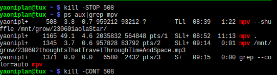

- #### Stop a process in Linux
    - `kill -STOP 508`
- ***Notes***
    - `508` # Replace it with your process ID
        - `ps aux | grep mpv`
    - `kill -CONT 508` # Continue
- ***References***
    - 
    - ChatGPT
- ---
