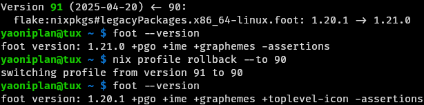

- #### Use "nix"
    - `nix eval nixpkgs#smartcat.meta.homepage` # Get the home page in metadata
      ```
      "https://github.com/efugier/smartcat"
      ```
        - `nix eval nixpkgs#smartcat.meta --json | jq .` # Get metadata
    - `nix profile install github:abenz1267/walker` # Build a software (Spend a lot of time)
    - `nix profile install nixpkgs/24fe8bb4f552ad3926274d29e083b79d84707da6#obs-studio` # Install lower version packages
        - https://www.nixhub.io/packages/obs-studio
    - `nix search nixpkgs#firefox` # Search for the package
        - `nix search nixpkgs opencv` # Another way
        - https://search.nixos.org/ # Method two
    - `nix develop --impure` # Enter the development shell with isolated environment
        - `vim flake.nix`
          ```
          {
            description = "Dev shell with backblaze-b2";

            inputs.nixpkgs.url = "github:NixOS/nixpkgs/nixos-unstable";

            outputs = { self, nixpkgs }: {
              devShells.x86_64-linux.default =
                nixpkgs.legacyPackages.x86_64-linux.mkShell {
                buildInputs = [ nixpkgs.legacyPackages.x86_64-linux.backblaze-b2 ];
                shellHook = ''
                  export B2_ACCOUNT_INFO=$(mktemp)
                '';
              };
            };
          }
          ```
    - `nix flake new --template github:the-nix-way/dev-templates#node testNode` # Create a *node* project in directory *testNode*
        - `nix develop` # Enter a development environment after writing flake.nix
    - `nix shell nixpkgs#git` # Install a package temporarily
        - `nix-shell --command 'jupyter notebook' --packages jupyter` # Use temporarily
        - `nix shell nixpkgs#firefox --command firefox yourURL` # Use temporarily
        - `nix-shell --packages python310Packages.numpy python310Packages.opencv4` # Another way
        - `nix shell nixpkgs#fortune nixpkgs#cowsay --command sh -c 'fortune | cowsay'`
    - `nix profile install nixpkgs#hello` # Install a package permantently
        - `nix profile upgrade /nix/store/b0z563zg65fnxaqp612cbxv7x5y7pnz2-foot-1.16.2` # Upgrade a package
        - `nix profile rollback --to 90` # Roll back to version 90 (Because the new version has some bugs)
        - `nix profile history` # Get the version number (e.g. 90)
        - `nix profile remove /nix/store/2g3jazymqbjw9c390c3b7vw8xq3r8iny-hello-2.12.1` # Remove it
        - `nix profile list` # List installed packages
- ***Notes***
    - Fix API rate limiting issues on GitHub
      ```
      yaoniplan@tux /tmp/tmp.ItcK2amanT $ nix flake new -t templates#go-hello .
      error:
             … while fetching the input 'github:NixOS/templates'

             error: unable to download 'https://api.github.com/repos/NixOS/templates/commits/HEAD': HTTP error 403

             response body:

             {"message":"API rate limit exceeded for 35.77.62.80. (But here's the good news: Authenticated requests get a higher rate limit. Check out the documentation for more details.)","documentation_url":"https://docs.github.com/rest/overview/resources-in-the-rest-api#rate-limiting"}
      yaoniplan@tux /tmp/tmp.ItcK2amanT $
      ```
        - `doas vim /etc/nix/nix.conf`
          ```
          access-tokens = github.com=yourPersonalAccessToken
          ```
        - `export GITHUB_TOKEN="yourPersonalAccessToken"` # Another way (Warning: It does not work sometimes.)
        - `yourPersonalAccessToken` # Replace it with your PAT (In "Personal access tokens" of "Developer Settings", need to grant 'repo' access)
    - Solve the problem
      ```
      error: Must provide at least one regex! To match all packages, use 'nix search <installable> ^'.
      Try 'nix --help' for more information.
      ```
        - `nix search nixpkgs#tofi ^` # Add a regex
    - Solve the problem
      ```
      error: writing to file: No space left on device
      ```
        - `nix-collect-garbage` # Delete unreachable store objects
        - `nix store optimise` # Replace identical files in the store by hard links
        - https://libreddit.nohost.network/r/NixOS/comments/1cunvdw/friendly_reminder_optimizestore_is_not_on_by/
    - Solve the problem
      ```
      yaoniplan@tux ~ $ nix upgrade-nix
      error: directory '/home/yaoniplan/.nix-profile/bin' does not appear to be part of a Nix profile
      yaoniplan@tux ~ $
      ```
        - `ls -l $(which nix)` # Get Nix executable path
        - `nix profile remove /nix/store/smfmnz0ylx80wkbqbjibj7zcw4q668xp-nix-2.19.2/bin/nix` # Remove the package
        - `/nix/store/iwgkck1d64s5f26ngln540hpf06g28py-nix-2.20.1/bin/nix profile install nixpkgs#nix` # Reinstall the package
        - https://github.com/NixOS/nix/issues/5473#issuecomment-1309181669
    - Solve the problem
      ```
      ...
      It seems the build group nixbld already exists, but
      with the UID 967. This script can't really handle
      that right now, so I'm going to give up.
      
      You can fix this by editing this script and changing the
      NIX_BUILD_GROUP_ID variable near the top to from 30000
      to 967 and re-run.
      ...
      ```
        - `doas rm -rf /nix/ ~/.nix*` # Uninstall Nix
        - `compgen -u` # List all users
        - `for user in nixbld{01..10}; do sudo userdel $user; done` # Delete the users created by Nix
        - `doas groupdel nixbld` # Delete the Nix group
    - Solve the problem
      ```
      yaoniplan@tux ~ $ nix search nixpkgs#excel
      error:
             … while fetching the input 'github:NixOS/nixpkgs/nixpkgs-unstable'
      
             error: creating directory '/nix/store/tmp-2004-1': Permission denied
      yaoniplan@tux ~ $
      ```
        - `doas chown -R $(whoami) /nix/store/` # Change the owner
    - Solve the problem
      ```
      yaoniplan@tux ~ $ nix-shell -p nix-info --run "nix-info -m"
      error:
           … <borked>

             at «none»:0: (source not available)
           ...
      ```
        - `nix-channel --update`
    - Enable flakes
      ```
      error: experimental Nix feature 'nix-command' is disabled; add '--extra-experimental-features nix-command' to enable it
      ```
        - `echo "experimental-features = nix-command flakes" | doas tee -a /etc/nix/nix.conf`
    - `doas vim /etc/nix/nix.conf` # Set mirror in Nix
      ```
      substituters = https://mirrors.ustc.edu.cn/nix-channels/store https://cache.nixos.org/
      ```
        - `nix-channel --add https://mirrors.ustc.edu.cn/nix-channels/nixpkgs-unstable nixpkgs`
        - `nix-channel --update`
    - `curl -L https://nixos.org/nix/install | sh` # Install Nix package manager
        - `-L` # Location
        - `wget -O- https://nixos.org/nix/install | sh` # Another way to install
        - `-O-` # The same as `-L` of `curl`
        - `source ~/.nix-profile/etc/profile.d/nix.sh` # Apply changes
        - `doas rm -rf /nix/ /etc/nix/ ~/.nix-{profile,defexpr,channels}` # Uninstall
- ***References***
    - 
    - https://discourse.nixos.org/t/flakes-provide-github-api-token-for-rate-limiting/18609
    - 
    - https://docs.fluidattacks.com/development/stack/nix/#troubleshooting
    - https://github.com/the-nix-way/dev-templates
    - https://github.com/NixOS/nix/issues/7937#issuecomment-1455013868
    - https://xeiaso.net/blog/nix-flakes-1-2022-02-21
    - https://nixos.wiki/wiki/Flakes
    - https://www.youtube.com/watch?v=o1Y7rWrPEO8
    - https://ghedam.at/a-tour-of-nix-flakes
    - https://mirrors.ustc.edu.cn/help/nix-channels.html
    - https://github.com/NixOS/nix
    - `nix profile --help`
    - `man curl`
    - Artificial intelligence
- ---
