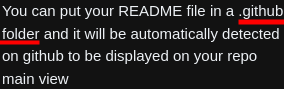

- #### Bash completion in [[Gentoo Linux]]
	- `doas emerge -aq app-shells/bash-completion`
	- `set -o` # Show the current settings
		- `set -o vi` # Enable vi mode (press `Esc` prefix key to edit)
- ***References***
	- [Bash - Gentoo Wiki](https://wiki.gentoo.org/wiki/Bash)
- ---
- #### Use #tmux plugins manager
	- `mkdir -p ~/.tmux/plugins/`
	- `git clone https://github.com/tmux-plugins/tpm ~/.tmux/plugins/tpm`
	- `vim ~/.tmux.conf`
	  ```
	  # Lists of plugins
	  set -g @plugin 'tmux-plugins/tpm'
	  
	  # Initialize tmux plugins manager
	  # (Put this line at the bottom)
	  run -b '~/.tmux/plugins/tpm/tpm'
	  ```
	- `tmux source ~/.tmux.conf` # Reload Tmux
- ***Notes***
	- Install plugins
		- `vim ~/.tmux.conf`
		  ```
		  set -g @plugin 'tmux-plugins/yank'
		  ```
		- Press `prefix` + `I`
			- `I` # Install
	- Uninstll plugins
		- `vim ~/.tmux.conf`
		  ```
		  # set -g @plugin `tmux-plugins/yank`
		  ```
		- Press `prefix` + `Alt` + `u`
			- `u` # Uninstall
- ***References***
	- [Tmux/plugins/tpm - Gentoo Wiki](https://wiki.gentoo.org/wiki/Tmux/plugins/tpm)
- ---
- #### The #punctuation of #Caret is `^`
- ***References***
	- 
	- [Caret - Wikipedia](https://en.wikipedia.org/wiki/Caret)
- ---
- Add README to #GitHub when using a bare #Git repository
	- `mkdir ~/.github/`
	- `vim ~/.github/README.md`
- ***References***
	- 
	- 
	- [How to add README.md on github but not have same README.md in home directory while using a bare git repository for managing dotfiles? - Stack Overflow](https://stackoverflow.com/questions/62561933/how-to-add-readme-md-on-github-but-not-have-same-readme-md-in-home-directory-whi)
	- [About READMEs - GitHub Docs](https://docs.github.com/en/repositories/managing-your-repositorys-settings-and-features/customizing-your-repository/about-readmes)
- ---