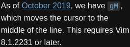

- #### Use #Rofi theme
	- ```
	  git clone https://github.com/newmanls/rofi-themes-collection
	  cd rofi-themes-collection
	  mkdir -p ~/.local/share/rofi/themes/
	  cp ./* ~/.local/share/rofi/themes/
	  ```
	- `rofi -show drun` # Show drun mode
- ***Notes***
	- `Rofi Theme Selector` # Type it in Rofi search bar
		- `Enter` # Preview
		- `Esc` # Cancel
		- `Alt-a` # Accept
	- Beautiful
		- |theme|theme|theme|theme|
		  |---|---|---|---|
		  |spotlight-dark|squared-nord|rounded-blue-dark|dmenu by Qball|
		  |nord-TwoLines|nord-oneline|sidebar-v2 by Qball|
	- features
		- Font: big
		- Color: dark
		- Icon (optional)
- ***References***
	- [newmanls/rofi-themes-collection: Themes Collection for Rofi Launcher](https://github.com/newmanls/rofi-themes-collection)
- ---
- #### Use #Vim
	- `gM` # Move cursor to the middle of a line
	- `r` # Replace
	- Mark
		- m + a # Mark as a
		- ` + a # Jump to mark a
- #### Notes
	- Try it https://github.com/hackjutsu/vim-cheatsheet
- ***References***
	- 
	- [How do I move the cursor to the center of current line? - Vi and Vim Stack Exchange](https://vi.stackexchange.com/questions/2462/how-do-i-move-the-cursor-to-the-center-of-current-line)
- ---
- #### Set dark theme in #Linux
	- `vim ~/.config/gtk-3.0/settings.ini`
	  ```
	  [Settings]
	  gtk-application-prefer-dark-theme=1
	  ```
- ***Notes***
	- #Chrome
		- `about:settings` # Type it in search bar
		- `Ctrl-f` # Press it and type `appearance`
		- `Use GTK` # Click it
	- `doas reboot` # Make it work
- References
	- 
	- [gnome3 - How can I use Adwaita Dark for all applications in Gnome 3? - Unix & Linux Stack Exchange](https://unix.stackexchange.com/questions/63389/how-can-i-use-adwaita-dark-for-all-applications-in-gnome-3)
	- [Gentoo Forums :: View topic - [solved] Adwaita dark works only for Gtk2 not Gtk3](https://forums.gentoo.org/viewtopic-t-1079650-start-0.html)
- ---