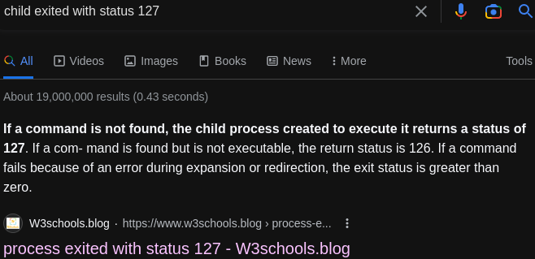

- #### Return to the last used tab in Chrome
    - Press `Ctrl-Shift-a` and then press `Enter`
- ***References***
    - https://superuser.com/questions/402095/switching-back-to-last-used-tab-on-chrome/1679002#1679002
- ---
- #### Enclose the shell command in double quotes
    - `st -e tmux -c "vim -c VimwikiIndex"`
- ***Notes***
    - If there are no spaces
      ```
      > st -e tmux -c vim -c VimwikiIndex
      child exited with status 127
      ```
    - Warning: the tmux doesn't work
- ***References***
    - `man tmux`
    - 
    - 
- ---
- #### Remap keys in Vim
    - `vim ~/.vimrc`
      ```
      nnoremap <C-H> <C-W>h
      nnoremap <C-J> <C-W>j
      nnoremap <C-K> <C-W>k
      nnoremap <C-L> <C-W>l
      ```
- ***Notes***
    - `C-H` # Use `Ctrl-h` to move cursor to the left panel
    - `<C-W>h` # Use `<Ctrl-w>h` to move cursor to the left panel too
- ***References***
    - https://superuser.com/questions/280500/how-does-one-switch-between-windows-on-vim
- ---
- #### Modify a specify commit message in Git
    - `dotfiles rebase --interactive '019ae22^'` # Replace `pick` with `edit` and then `:wq`
    - `dotfiles commit --amend` # Amend your commit message
    - `dotfiles rebase --continue`
    - `dotfiles push --force`
- ***Notes***
    - Disadvantage
        - Modify date
- ***References***
    <!-- Add a demo.gif here -->
    - https://stackoverflow.com/questions/1186535/how-do-i-modify-a-specific-commit/1186549#1186549
