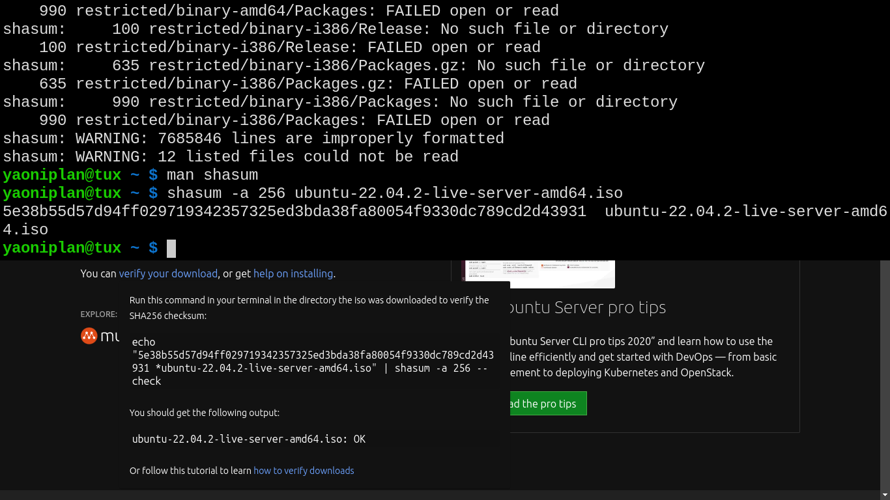

- #### Use shasum to verify the checksum in Unix-like
    - `shasum -a 256 ubuntu-22.04.2-live-server-amd64.iso`
- ***Notes***
    - `-a` # Algorithm
    - `256` # Replace it with other algorithm (e.g. *512*)
- ***References***
    - `man shasum`
    - 
    - https://ubuntu.com/download/server
- ---
- #### Understand "Statue of Liberty"
    - A statue
    - In the United States
- ***References***
    - https://en.wikipedia.org/wiki/The_Legend_of_1900
    - https://en.wikipedia.org/wiki/Statue_of_Liberty
- ---
- #### Keep the sshd active when closing the laptop lid
    - `sudo vim /etc/systemd/logind.conf`
      ```
      #HandleLidSwitch=suspend
      HandleLidSwitch=ignore
      ```
- ***Notes***
    - Solve the problem
      ```
      yaoniplan@tux ~ $ ssh root@192.168.10.100
      ssh: connect to host 192.168.10.100 port 22: No route to host
      ```
- ***References***
    - https://askubuntu.com/questions/113824/how-to-keep-ssh-server-running-with-laptop-lid-closed/1371882#1371882
- ---
- #### Install Docker in Ubuntu server
    - Follow the steps of this [website](https://docs.docker.com/engine/install/ubuntu/)
- ***Notes***
    - `sudo usermod -aG docker heting` # Add the user to the docker group in Linux
        - `-a` # Append
        - `-G` # Group
        - `heting` # Replace it with your user
    - `reboot` # Make the changes effective
    - `docker --version` # Verify the installation
- ***References***
    - `man usermod`
    - `man docker`
    - https://www.zdnet.com/article/docker-101-how-to-install-docker-on-ubuntu-server-22-04/
- ---
- #### Use Docker
    - `docker search aliyunpan-sync` # Search for Docker images online
    - `docker images` # Check Docker images
    - `docker ps` # Process
- ***References***
    - https://phoenixnap.com/kb/install-docker-on-ubuntu-20-04
- ---
