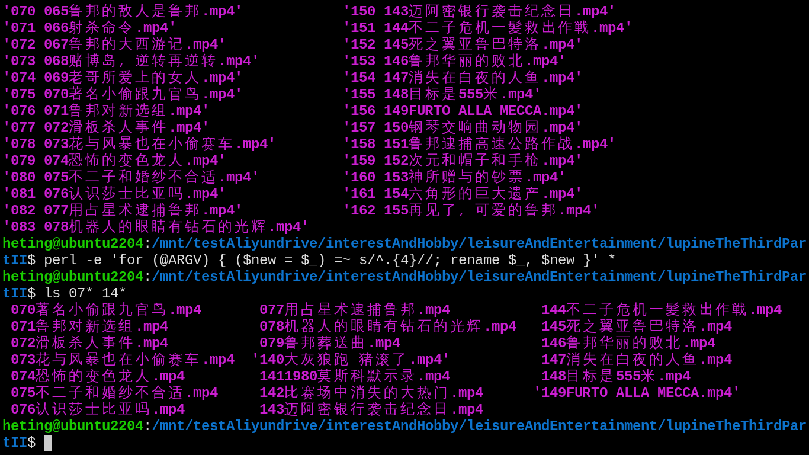

- #### Use aliyunpan-sync in Docker
    - In Docker
      ```
      docker run -d --name=aliyunpan-sync --restart=always -v "<your local dir>:/home/app/data" -e TZ="Asia/Shanghai" -e ALIYUNPAN_REFRESH_TOKEN="<your refreshToken>" -e ALIYUNPAN_PAN_DIR="<your drive pan dir>" -e ALIYUNPAN_SYNC_MODE="upload" -e ALIYUNPAN_TASK_STEP="sync" tickstep/aliyunpan-sync:v0.2.6
      ```
- ***Notes***
    - `/var/aliyundrive`
    - `:v0.2.6` # Sovle the problem
      ```
      docker: Error response from daemon: manifest for tickstep/aliyunpan-sync:latest not found: manifest unknown: manifest unknown.
      ```
- ***References***
    - https://github.com/tickstep/aliyunpan#docker安装
- ---
- #### Use the "screen" command in Ubuntu Server 22.04
    - `screen vim someCPrograms/checkPrimeNumber.c`
    - `screen -list` # Get ID and name of sessions
    - `screen -S testScreenList` # Create a session
    - `screen -X -S 14099 quit` # Terminate a session
    - `screen -r testScreenReattach` # Reattach a session
    - `Ctrl-a d` # Deattach
- ***Notes***
    - `-S` # Sessionname
    - `testScreenList` # Replace it with your desired session name
    - `14099` # Replace it with ID of sessions
- ***References***
    - `man screen`
    - ChatGPT
- ---
- #### Remove the first four letters of filenames using Perl
    - `perl -e 'for (@ARGV) { ($new = $_) =~ s/^.{4}//; rename $_, $new }' *`
- ***Notes***
    - `-e` # Execute
    - `$new` # A variable
    - `$_` # The current filename
- ***References***
    - ChatGPT
    - 
- ---
- #### Mount the AList to the local dirctory using Rclone
    - `rclone config`
      ```
      n # n) New remote
      aliyundrive # name
      45 # Storage of WebDAV
      http://192.168.10.100:5244/dav # URL
      1 # vendor of Nextcloud
      admin # user
      y # y) Yes this is OK (default)
      q # q) Quit config
      ```
    - `doas mkdir /mnt/testAliyundrive/`
    - `rclone mount aliyundrive:/ /mnt/testAliyundrive/`
- ***Notes***
    - `doas apt install rclone` # Install it in Ubuntu Server 22.04
    - `rclone lsd aliyundrive:/` # Check it
- ***References***
    - ChatGPT
    - https://www.youtube.com/watch?v=hoUPP1aLE60
- ---
