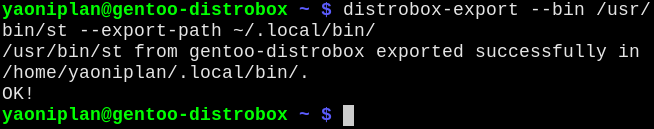

- #### Use "distrobox"
    - `distrobox create --image debian:latest --name debian-distrobox` # Create a container
        - `debian` # Replace it with other Linux distribution (e.g. `gentoo/stage3`)
    - `distrobox enter --name debian-distrobox` # Enter a container
        - `distrobox list` # Get container name
    - `distrobox rm debian-distrobox` # Remove a container
        - `rm` # Replace it with `stop` to stop it before removing if container is running
    - `distrobox-export --bin /usr/bin/st --export-path ~/.local/bin/` # Export an application
        - Append ` -delete` to the end of the line to delete the exported application
- ***Notes***
    - `nix profile install nixpkgs#distrobox` # Install dependencies
- ***References***
    - 
    - `man distrobox-export` # `/examples`
        - Replace `export` with other action (e.g. `create`)
- ---
