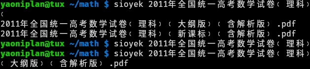

- #### Select next match in Bash
    - `Ctrl-i` # Get two or more matching results (The same as `Tab`)
        - `Ctrl-n` # Next
- ***Notes***
    - Because to autocomplete file name without copying and typing manually.
- ***References***
    - 
- ---
