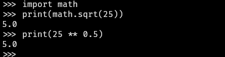

- #### Calculate the square root of a number in Python interpreter
    - Use `math` module
      ```
      import math
      print(math.sqrt(25))
      ```
        - `math` # Built-in module
        - `sqrt` # Function
        - `25` # Argument
    - Use `**` operator
      ```
      print(25 ** 0.5)
      ```
        - `**` # Exponentiation operator
- ***Notes***
    - Because to identify that $\sqrt{}$ is the principal square root function which outputs non-negative value.
- ***References***
    - https://libreddit.tux.pizza/r/askmath/comments/15ed9m3/is_there_an_internationally_agreed_upon/ju6uba1
    - 
    - ChatGPT
- ---
- #### The domain of the function $y=\sqrt{x(x-1)}+\sqrt{x}$ is
    - In the function, for each value of $x$, $y$ must have unique value
    - The expression under the square root must be non-negative
- ***Notes***
    - $\\{x|x\ge1\\}\cup{0}$
- ***References***
    - College Entrance Math in Jiangxi
- ---
