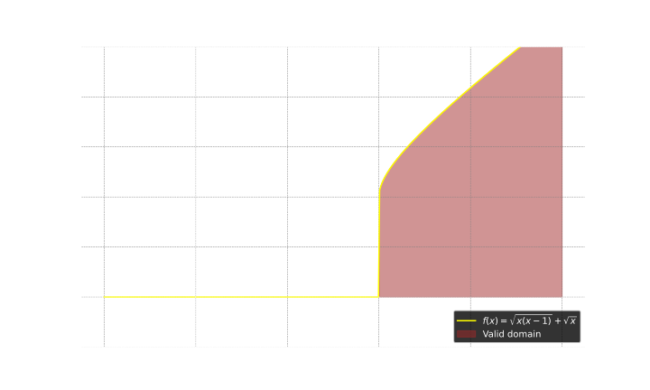

- #### Calculate the square root of a number in Python interpreter
    - `python` # Use `math` module
      ```
      import math
      print(math.sqrt(25))
      ```
        - `math` # Built-in module
        - `sqrt` # Function
        - `25` # Argument
    - `python` # Use `**` operator
      ```
      print(25 ** 0.5)
      ```
        - `**` # Exponentiation operator
- ***Notes***
    - Because to verify that $\sqrt{}$ is the principal square root function which outputs non-negative value.
- ***References***
    - https://libreddit.tux.pizza/r/askmath/comments/15ed9m3/is_there_an_internationally_agreed_upon/ju6uba1
    - https://libreddit.tux.pizza/r/learnmath/comments/19chijc/why_x²_gives_x_and_not_in_4_why_it_only_gives_2/kj0ti76
    - https://libreddit.tux.pizza/r/learnmath/comments/19chijc/why_x²_gives_x_and_not_in_4_why_it_only_gives_2/kiyv2v6
    - https://libreddit.tux.pizza/r/learnmath/comments/19chijc/why_x²_gives_x_and_not_in_4_why_it_only_gives_2/kj11hvz
    - https://libreddit.tux.pizza/r/learnmath/comments/10oebmz/is_square_root_always_a_positive_number/j6f3aqc
    - https://libreddit.tux.pizza/r/learnmath/comments/10oebmz/is_square_root_always_a_positive_number/j6e9d7n
    - https://libreddit.tux.pizza/r/learnmath/comments/10oebmz/is_square_root_always_a_positive_number/j6ebz7h
    - 
    - ChatGPT
- ---
- #### The domain of the function $y=\sqrt{x(x-1)}+\sqrt{x}$ is
    - Square root
        - Every nonnegative real number $x$ has a unique nonnegative square root
- ***Notes***
    - $x(x-1)\ge0$ ($x=0$ and $x=1$) # $x\le0$ or $x\ge1$
        - If $x<0$, then $x$ is negative and $x-1$ is negative, so $(x(x-1))$ is positive
        - If $0<x<1$, then $x$ is positive and $x-1$ is negative, so $x(x-1)$ is negative
        - If $x>1$, then $x$ is positive and $x-1$ is positive, so $(x(x-1))$ is positive
    - $x\ge0$
- ***References***
    - 
    - https://en.wiktionary.org/wiki/principal_root
    - https://en.wikipedia.org/wiki/Domain_of_a_function#/media/File:Square_root_0_25.svg
    - https://en.wikipedia.org/wiki/Square_root
    - College Entrance Math in Jiangxi
    - ChatGPT
- ---
