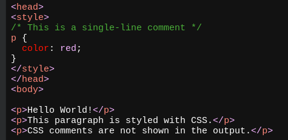
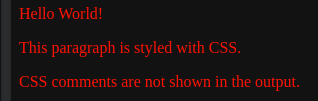

- # Introduction
  CSS is the language we use to style a Web pages.
- # Syntax
  ```
  Selector {Property:Value; Property:Value;}
  ```
- # Comments syntax
  On both sides of content, add `/*` and `*/` respectively
  * ***Usage***  
  
  * ***Preview***  
  
-