- # Introduction
  HTML is the standard markup language for creating Web pages.
- # Headings syntax
  On both sides of the content, add `<h1>` and `</h1>` respectively
  * ***Usage***  
  
  * ***Preview***  
  
- # Paragraphys syntax
- ## 1. Paragraphys
  On both sides of the content, add `
` and `
` respectively
  * ***Usage***  
  
  * ***Preview***  
  
- ## 2. Horizontal rules
  After `</h1>` or `
` , add `
`
  * ***Usage***  
  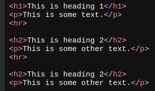
  * ***Preview***  
  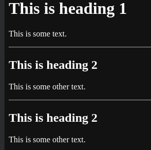
- ## 3. Line Breaks
  Add ` ` to the content
  * ***Usage***  
  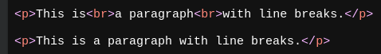
  * ***Preview***  
  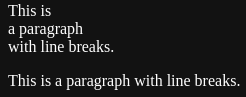
- ## 4. The Poem Problem
  On both sides of the content, add `<pre>` and `</pre>` respectively
  * ***Usage***  
  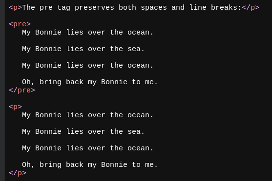
  * ***Preview***  
  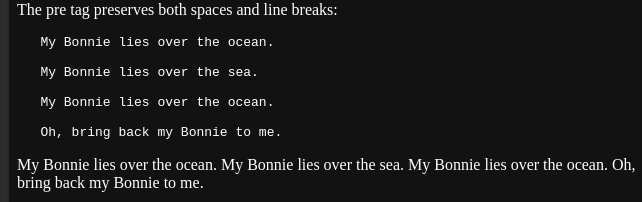
- # Text formatting syntax
- ## 1. Bold
  On both sides of the content, add `<b>` and `</b>` respectively (alternatives `<strong>` and `</strong>`)
  * ***Usage***  
  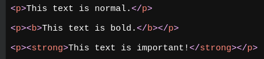
  * ***Preview***  
  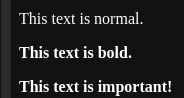
- ## 2. Italic
  On both sides of the contene, add `<i>` and `</i>` respectively (alternatives `<em>` and `</em>`)
  * ***Usage***  
  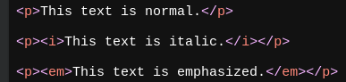
  * ***Preview***  
  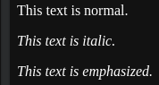
- ## 3. Smaller
  On both sides of the content, add `<small>` and `</small>` respectively
  * ***Usage***  
  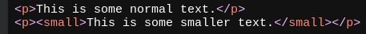
  * ***Preview***  
  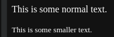
- ## 4. Marked or Highlighted
  On both sides of the content, add `<mark>` and `</mark>` respectively
  * ***Usage***  
  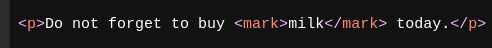
  * ***Preview***  
  
- ## 5. Deleted
  On both sides of the content, add `<del>` and `</del>` respectively
  * ***Usage***  
  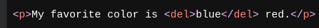
  * ***Preview***  
  
- ## 6. Inserted
  On both sides of the content, add `<ins>` and `</ins>` respectively
  * ***Usage***  
  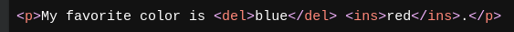
  * ***Preview***  
  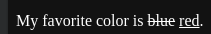
- ## 7. Subscripted
  On both sides of the content, add `` and `` respectively
  * ***Usage***  
  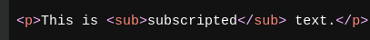
  * ***Preview***  
  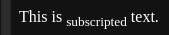
- ## 8. Superscripted
  On both sides of the content, add `` and `` respectively
  * ***Usage***  
  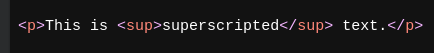
  * ***Preview***  
  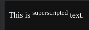
-