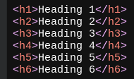
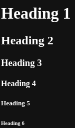
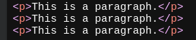
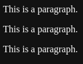

- # Introduction
  HTML is the standard markup language for creating Web pages.
- # Headings syntax
  On both sides of the content, add `<h1>` and `</h1>` tag respectively
  * ***Usage***  
  
  * ***Preview***  
  
- # Paragraphy syntax
  On both sides of content, add `
` and `
` tag respectively
  * ***Usage***  
  
  * ***Preview***  
  
-