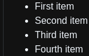

- # Introduction
  Markdown is a lightweight markup language that allows people to write documents in plain text format that is easy to read and write. The suffix of Markdown files is ".md".
- # Headings Syntax
  Before a word or phrase, add number signs and a space (`# `).
	- ***Usage***  
	  
	- ***Preview***  
	  
- # Lists Syntax
	- ## 1. Unordered lists
	  Before the list item, add a hypen (`-`), a asterisk (`*`) or a plus (`+`).
		- ***Usage***  
		  
		- ***Preview***  
		  
- # Images Syntax
	- ## 2. Basic Images
	  Add an exclamation mark (`!`), followed by alt text in square brackets (`[]`), and the path or URL to the image asset in round brackets (`()`).
		- ***Usage***
- # 标题语法
  在单词或短语前，添加`# `(井号+空格)。
	- ***写法***  
	  
	- ***预览***  
	  
- # 段落语法
  使用`空白行`，将一行或多行文本进行分隔。
	- ***写法***  
	  
	- ***预览***  
	  
- # 换行语法
  在结尾，添加`“结尾空格”`(两个空格+回车)或HTML` `标签。
	- ***写法***  
	  
	- ***预览***  
	  
- # 强调语法
	- ## 1. 粗体
	  在要强调部分的前后，各添加`**`(两个星号)。
		- ***写法***  
		  
		- ***预览***  
		  
	- ## 2. 斜体
	  在要强调部分的前后，各添加`*`(一个星号)。
		- ***写法***  
		  
		- ***预览***  
		  
	- ## 3. 粗体和斜体
	  在要强调部分的前后，各添加`***`(三个星号)。
		- ***写法***  
		  
		- ***预览***  
		  
	- ## 4. 删除线  
	  在单词前后，使用两个`~~`(波浪线)
		- ***写法***  
		  
		- ***预览***  
		  
	- ## 5. 高亮  
	  在单词前后，使用两个`==`(等于号)
		- ***写法***  
		  
		- ***预览***  
		  
- # 引用语法
	- ## 1. 块引用
	  在段落前，添加`>`(大于号)。
		- ***写法***  
		  
		- ***预览***  
		  
	- ## 2. 多个段落的块引用
	  在段落之间的空白行，添加`>`(大于号)。
		- ***写法***  
		  
		- ***效果***  
		  
	- ## 3. 嵌套块引用
	  在要嵌套的段落前，添加`>>`(两个大于号)。
		- ***写法***  
		  
		- ***预览***  
		  
	- ## 4. 带有其他元素的块引用
	  需要进行`实验`，以查看哪些元素有效。
		- ***写法***  
		  
		- ***预览***  
		  
- # 列表语法
	- ## 1. 有序列表
	  在每个列表项前，添加`数字`(以数字 1 起始)并紧跟`英文句点`(.)和`空格`(space) 。
		- ***写法***  
		  
		- ***预览***  
		  
	- ## 2. 无序列表
	  在每个列表项前，添加`-`(破折号)、`*`(星号)或`+`(加号)
		- ***写法***  
		  
		- ***预览***  
		  
	- ## 3. 定义列表  
	  在第一行键入`术语`。在下一行，键入一个`冒号`，后跟一个`空格`和`定义`。
		- ***写法***  
		  
		- ***预览***  
		  
	- ## 4. 任务列表  
	  在任务列表之前，添加`破折号`(`-`)和`方括号`(`[]`)，并在方括号前面加上`空格`。要选择一个复选框，请在方括号之间，添加`x`。
		- ***写法***  
		  
		- ***预览***  
		  
	- ## 5. 在列表中嵌套段落
	  将该元素缩进`四个空格`或`一个制表符`
		- ***写法***  
		  
		- ***预览***  
		  
	- ## 6. 在列表中嵌套引用块
	  同样的，将该元素缩进`四个空格`或`一个制表符`
		- ***写法***  
		  
		- ***预览***  
		  
	- ## 7. 在列表中嵌套代码块
	  将代码块缩进`八个空格`或`两个制表符`
		- ***写法***  
		  
		- ***预览***  
		  {:height 283, :width 417}
	- ## 8. 在列表中嵌套图片
	  将图片缩进`四个空格`或`一个制表符`
		- ***写法***  
		  
		- ***预览***  
		  
	- ## 9. 在列表中嵌套列表
	  将列表缩进`四个空格`或`一个制表符`
		- ***写法***  
		  
		- ***预览***  
		  
- # 代码语法
	- ## 1. 单词或短语代码
	  将单词或短语包裹在`反引号`(`)中。
		- ***写法***  
		  
		- ***预览***  
		  
	- ## 2. 转义反引号
	  将单词或短语代码包裹在`双反引号`(``)中。
		- ***写法***  
		  
		- ***预览***  
		  
	- ## 3. 代码块
	  在代码块之前和之后的行上，使用三个`反引号`(\`\`\`)
		- ***写法***  
		  
		- ***预览***  
		  
	- ## 4. 语法高亮
	  在受防护的代码块之前的`反引号旁边`，`指定`一种`语言`
		- ***写法***  
		  
		- ***预览***  
		  
- # 分隔线语法
  在单独一行上，使用三个`星号`(\*\*\*)、`破折号`(\-\-\-)或`下划线`(\_\_\_)
	- ***写法***  
	  
	- ***预览***  
	  
- # 链接语法
	- ## 1. 超链接
	  链接文本放在方括号内，链接地址放在后面的圆括号中。  
	  `[超链接显示名](超链接地址)`
		- ***写法***  
		  
		- ***预览***  
		  
	- ## 2. 加 Title 的超链接  
	  title放在圆括号中链接地址的`后面`，并且跟链接地址之间以`空格`分隔。
		- ***写法***  
		  
		- ***预览***  
		  
	- ## 3. 简化的超链接
		- ### 1. 简化一点的超链接  
		  在URL或email地址前，添加`<`(小于号)；在其后，添加`>`(大于号)
			- ***写法***  
			  
			- ***预览***  
			  
		- ### 2. 更简化的超链接  
		  因为markdown处理器会自动将URL转换为链接。所以请直接输入`URL`。
			- ***参考***  
			  
			- ***预览***  
			  
	- ## 4. 带格式化的超链接
	  需要进行`实验`，以查看哪些元素有效。
		- ***写法***  
		  
		- ***预览***  
		  
	- ## 5. 引用类型的超链接  
	  分为两部分：与文本保持`內联`的部分、存储在文件中`其他位置`的部分。
		- ***写法***  
		    
		  
		- ***预览***  
		  (无)
- # 图片语法
	- ## 1. 图片  
	  使用感叹号(!)，然后在方括号增加替代文本，图片链接放在圆括号里，括号里的链接后，可以增加一个可选的图片标题文本。  
	  ``
		- ***写法***  
		  
		- ***预览***  
		  
	- ## 2. 有链接的图片  
	  将图像的Markdown括在方括号中，然后将链接添加在圆括号中。
		- ***写法***  
		  
		- ***预览***  
		  
- # 转义字符语法  
  在字符前面，添加`反斜杠`(`\`)。
	- ***写法***  
	  
	- ***预览***  
	  
- # 表格语法
	- ## 1. 表格  
	  使用三个`连字符(---)`创建每列的标题，并使用`管道(|)`分隔每列。
		- ***写法***  
		  
		- ***预览***  
		  
	- ## 2. 对齐的表格  
	  在标题行中连字符的左侧，右侧或两侧，添加`冒号(:)`，将列中的文本对齐到左侧，右侧或中心
		- ***写法***  
		  
		- ***预览***  
		  
- # 注脚语法  
  在方括号内，添加`插入符号(^)`和`标识符(数字或单词)`。  
  在括号内使用另一个插入符号和数字添加脚注，并用`冒号(:)`和`文本`。
	- ***写法***  
	  
	- ***预览***  
	  
- # 使用emoji表情
	- ## 1. 复制和粘贴表情符号
	- ## 2. 使用表情符号简码  
	  以`冒号(:)`开头和结尾，并包含`表情符号的名称`。
		- ***写法***  
		  
		- ***预览***  
		  
- # 数学公式语法
	- ## 高级运算
		- ### 算术平均值
		- ***写法***  
		  
		- ***预览***  
		  
- # References
	- [Markdown Guide](https://www.markdownguide.org/ "Markdown Guide")
	- [Markdown 官方教程](https://markdown.com.cn/ "Markdown 官方教程")
	- [Markdown数学公式](https://www.jianshu.com/p/4d823d1b9c71 "Markdown数学公式")
	  
	  <!--
	  - # 简介
	    Markdown 是一种轻量级标记语言，它允许人们使用易读易写的纯文本格式编写文档，Markdown文件的后缀名便是“.md”。
	  - # 标题语法
	    在单词或短语前，添加`# `(井号+空格)。
	  	- ***写法***  
	  
	  	- ***预览***  
	  
	  - # 段落语法
	    使用`空白行`，将一行或多行文本进行分隔。
	  	- ***写法***  
	  
	  	- ***预览***  
	  
	  - # 换行语法
	    在结尾，添加`“结尾空格”`(两个空格+回车)或HTML` `标签。
	  	- ***写法***  
	  
	  	- ***预览***  
	  
	  - # 强调语法
	  	- ## 1. 粗体
	  在要强调部分的前后，各添加`**`(两个星号)。
	  		- ***写法***  
	   
	  		- ***预览***  
	   
	  	- ## 2. 斜体
	  在要强调部分的前后，各添加`*`(一个星号)。
	  		- ***写法***  
	   
	  		- ***预览***  
	   
	  	- ## 3. 粗体和斜体
	  在要强调部分的前后，各添加`***`(三个星号)。
	  		- ***写法***  
	   
	  		- ***预览***  
	   
	  	- ## 4. 删除线  
	  在单词前后，使用两个`~~`(波浪线)
	  		- ***写法***  
	   
	  		- ***预览***  
	   
	  	- ## 5. 高亮  
	  在单词前后，使用两个`==`(等于号)
	  		- ***写法***  
	   
	  		- ***预览***  
	   
	  - # 引用语法
	  	- ## 1. 块引用
	  在段落前，添加`>`(大于号)。
	  		- ***写法***  
	   
	  		- ***预览***  
	   
	  	- ## 2. 多个段落的块引用
	  在段落之间的空白行，添加`>`(大于号)。
	  		- ***写法***  
	   
	  		- ***效果***  
	   
	  	- ## 3. 嵌套块引用
	  在要嵌套的段落前，添加`>>`(两个大于号)。
	  		- ***写法***  
	   
	  		- ***预览***  
	   
	  	- ## 4. 带有其他元素的块引用
	  需要进行`实验`，以查看哪些元素有效。
	  		- ***写法***  
	   
	  		- ***预览***  
	   
	  - # 列表语法
	  	- ## 1. 有序列表
	  在每个列表项前，添加`数字`(以数字 1 起始)并紧跟`英文句点`(.)和`空格`(space) 。
	  		- ***写法***  
	   
	  		- ***预览***  
	   
	  	- ## 2. 无序列表
	  在每个列表项前，添加`-`(破折号)、`*`(星号)或`+`(加号)
	  		- ***写法***  
	   
	  		- ***预览***  
	   
	  	- ## 3. 定义列表  
	  在第一行键入`术语`。在下一行，键入一个`冒号`，后跟一个`空格`和`定义`。
	  		- ***写法***  
	   
	  		- ***预览***  
	   
	  	- ## 4. 任务列表  
	  在任务列表之前，添加`破折号`(`-`)和`方括号`(`[]`)，并在方括号前面加上`空格`。要选择一个复选框，请在方括号之间，添加`x`。
	  		- ***写法***  
	   
	  		- ***预览***  
	   
	  	- ## 5. 在列表中嵌套段落
	  将该元素缩进`四个空格`或`一个制表符`
	  		- ***写法***  
	   
	  		- ***预览***  
	   
	  	- ## 6. 在列表中嵌套引用块
	  同样的，将该元素缩进`四个空格`或`一个制表符`
	  		- ***写法***  
	   
	  		- ***预览***  
	   
	  	- ## 7. 在列表中嵌套代码块
	  将代码块缩进`八个空格`或`两个制表符`
	  		- ***写法***  
	   
	  		- ***预览***  
	   {:height 283, :width 417}
	  	- ## 8. 在列表中嵌套图片
	  将图片缩进`四个空格`或`一个制表符`
	  		- ***写法***  
	   
	  		- ***预览***  
	   
	  	- ## 9. 在列表中嵌套列表
	  将列表缩进`四个空格`或`一个制表符`
	  		- ***写法***  
	   
	  		- ***预览***  
	   
	  - # 代码语法
	  	- ## 1. 单词或短语代码
	  将单词或短语包裹在`反引号`(`)中。
	  		- ***写法***  
	   
	  		- ***预览***  
	   
	  	- ## 2. 转义反引号
	  将单词或短语代码包裹在`双反引号`(``)中。
	  		- ***写法***  
	   
	  		- ***预览***  
	   
	  	- ## 3. 代码块
	  在代码块之前和之后的行上，使用三个`反引号`(\`\`\`)
	  		- ***写法***  
	   
	  		- ***预览***  
	   
	  	- ## 4. 语法高亮
	  在受防护的代码块之前的`反引号旁边`，`指定`一种`语言`
	  		- ***写法***  
	   
	  		- ***预览***  
	   
	  - # 分隔线语法
	    在单独一行上，使用三个`星号`(\*\*\*)、`破折号`(\-\-\-)或`下划线`(\_\_\_)
	  	- ***写法***  
	  
	  	- ***预览***  
	  
	  - # 链接语法
	  	- ## 1. 超链接
	  链接文本放在方括号内，链接地址放在后面的圆括号中。  
	  `[超链接显示名](超链接地址)`
	  		- ***写法***  
	   
	  		- ***预览***  
	   
	  	- ## 2. 加 Title 的超链接  
	  title放在圆括号中链接地址的`后面`，并且跟链接地址之间以`空格`分隔。
	  		- ***写法***  
	   
	  		- ***预览***  
	   
	  	- ## 3. 简化的超链接
	  		- ### 1. 简化一点的超链接  
	   在URL或email地址前，添加`<`(小于号)；在其后，添加`>`(大于号)
	  - ***写法***  
	    
	  - ***预览***  
	    
	  		- ### 2. 更简化的超链接  
	   因为markdown处理器会自动将URL转换为链接。所以请直接输入`URL`。
	  - ***参考***  
	    
	  - ***预览***  
	    
	  	- ## 4. 带格式化的超链接
	  需要进行`实验`，以查看哪些元素有效。
	  		- ***写法***  
	   
	  		- ***预览***  
	   
	  	- ## 5. 引用类型的超链接  
	  分为两部分：与文本保持`內联`的部分、存储在文件中`其他位置`的部分。
	  		- ***写法***  
	     
	   
	  		- ***预览***  
	   (无)
	  - # 图片语法
	  	- ## 1. 图片  
	  使用感叹号(!)，然后在方括号增加替代文本，图片链接放在圆括号里，括号里的链接后，可以增加一个可选的图片标题文本。  
	  ``
	  		- ***写法***  
	   
	  		- ***预览***  
	   
	  	- ## 2. 有链接的图片  
	  将图像的Markdown括在方括号中，然后将链接添加在圆括号中。
	  		- ***写法***  
	   
	  		- ***预览***  
	   
	  - # 转义字符语法  
	    在字符前面，添加`反斜杠`(`\`)。
	  	- ***写法***  
	  
	  	- ***预览***  
	  
	  - # 表格语法
	  	- ## 1. 表格  
	  使用三个`连字符(---)`创建每列的标题，并使用`管道(|)`分隔每列。
	  		- ***写法***  
	   
	  		- ***预览***  
	   
	  	- ## 2. 对齐的表格  
	  在标题行中连字符的左侧，右侧或两侧，添加`冒号(:)`，将列中的文本对齐到左侧，右侧或中心
	  		- ***写法***  
	   
	  		- ***预览***  
	   
	  - # 注脚语法  
	    在方括号内，添加`插入符号(^)`和`标识符(数字或单词)`。  
	    在括号内使用另一个插入符号和数字添加脚注，并用`冒号(:)`和`文本`。
	  	- ***写法***  
	  
	  	- ***预览***  
	  
	  - # 使用emoji表情
	  	- ## 1. 复制和粘贴表情符号
	  	- ## 2. 使用表情符号简码  
	  以`冒号(:)`开头和结尾，并包含`表情符号的名称`。
	  		- ***写法***  
	   
	  		- ***预览***  
	   
	  - # 数学公式语法
	  	- ## 高级运算
	  		- ### 算术平均值
	  		- ***写法***  
	   
	  		- ***预览***  
	   
	  - # 参考资料
	  	- [Markdown 官方教程](https://markdown.com.cn/ "Markdown 官方教程")
	  	- [Markdown Guide](https://www.markdownguide.org/ "Markdown Guide")
	  	- [Markdown数学公式](https://www.jianshu.com/p/4d823d1b9c71 "Markdown数学公式")
	  -->